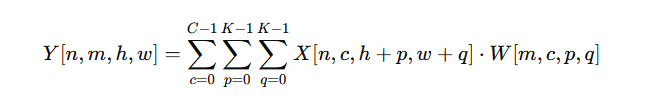

Formula for convolution using mini batches:

Conversion of Convolution Kernel to GEMM

* Each input column in the unrolled matrix contains all input feature maps required to compute a given output element
* Each filter is unrolled in row major form in the filter bank