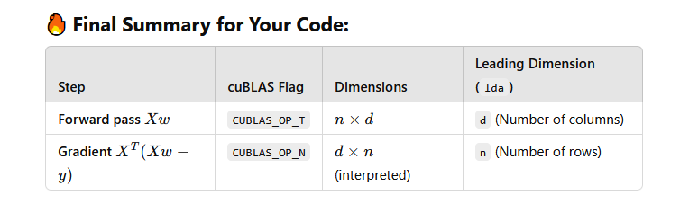

Ridge Regression

### Steps Using cuBLAS:

1. Forward Pass:
    Compute XwXw → Use cublasSgemv for matrix-vector multiplication.

2. Compute Error:
    Xw−y → Use cublasSaxpy (vector subtraction).

3. Compute Gradient:
    XT(Xw−y) → Use cublasSgemv.
    Add regularization term 2λw2λw → Use cublasSaxpy.

4. Update Weights:
    w=w−α∇w​ → Use cublasSaxpy.

5. Check Convergence:
    Stop when the loss stops decreasing significantly.

### Dimensions and data ordering
